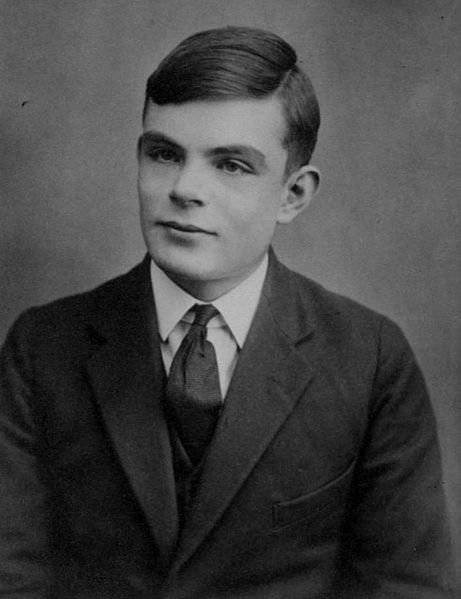

<table class="alan-turing">
    <tbody>
        <tr class="center table-head">
            <th colspan="2">Alan Turing</td>
        </tr>
        <tr>
            <td class="center" colspan="2">
                
                
Alan Turing vid 16 års ålder, 1927.

            </td>
        </tr>
        <tr>
            <th>Född</th>
            <td>23 juni 1912 Maida Vale, London</td>
        </tr>
        <tr>
            <th>Död</th>
            <td>7 juni 1954 (41 år) Wilmslow, Cheshire</td>
        </tr>
        <tr>
            <th>Nationalitet</th>
            <td>Brittisk</td>
        </tr>
        <tr>
            <th>Forskningsområde</th>
            <td>Matematik, kryptoanalys, datavetenskap, biologi</td>
        </tr>
        <tr>
            <th>Alma mater</th>
            <td>Sherborne School King's College, Cambridge Princeton University</td>
        </tr>
        <tr>
            <th>Känd för</th>
            <td>Turingmaskin, turingtest</td>
        </tr>
    </tbody>
</table>